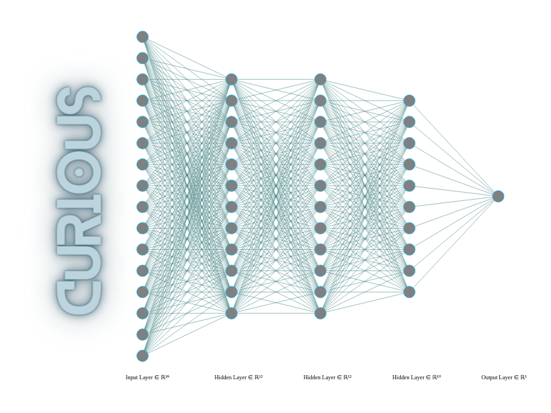

# A-Curious-FFN


Overview
--------
The project focuses on developing an FFN (Feed-Forward Network) model with a unique feature of "Artificial Curiosity". Artificial
Curiosity in the context of this project is a process that involves applying affine transformations to input test data and using a
model trained on regular; non-transformed data to predict on the transformed data. The model then filters the predictions based on
the least entropy for log-softmax values, specifically softmax values. The choice of the word "curiosity" to describe the process of
applying different transformations to test images makes sense, as it reflects the idea of exploring different possibilities to make
a prediction. The model is "curiosity-driven" in the sense that it explores different possibilities of orientations and mirroring of 
the test image in order to make a prediction, rather than relying solely on what it was trained on. This demonstrates some level of 
creativity in the sense that the model is able to find new ways of solving the problem of image recognition, rather than just being 
limited to what it was trained on. While the number and types of transformations used in this project are limited for demonstration 
purposes, the concept of artificial curiosity can be extended to include a range of creative transformations. This project uses a 
feed-forward neural network (FFN) because FFNs lack spatial perception and are unable to recognize images that do not resemble the 
training data. This weakness of FFNs is exploited to demonstrate the concept of artificial curiosity. When the model is predicting 
with 'curious' mode, it can recognize manipulated images, while in 'standard' mode, it cannot. This distinction provides a clear 
demonstration of the advantages and limitations of the two modes.

Table of Contents
-----------------
1. Primary Objective
2. Methodology
3. Results
4. Usage
5. Setup
6. Contributing
7. Credits
8. License
9. Contact

Primary Objective
-----------------
The primary objective of this project is to develop a Feed-Forward Network (FFN) model with a unique feature of "Artificial Curiosity".
The project aims to show that the model is able to find new ways of solving the problem of image recognition, demonstrating some level
of creativity. The project also aims to demonstrate the advantages and limitations of the "curious" and "standard" modes of the model 
in recognizing manipulated images.

Methodology
-----------
1. **Establish connection between Git repository on Google Drive and GitHub using SSH protocol.**<br>
  This step facilitates working with Google Colab and provides access to resources like GPUs if required.
  
2. **Download MNIST dataset through scikit-learn library**<br>
  Load, inspect and prepare the data for Deep Learning.  
  
3. **Split the data into train and test sets.**<br>
  First convert NumPy arrays to pytorch Tensors, use Stratified Shuffle Split technique to split the data, then convert to pytorch
  datasets using TensorDataset, finally translate to DataLoader Objects.
  
4. **Create and train a Feed Forward Network.**<br>
  Define an Abstract Base Class called BaseCuriosity, create concrete class called CuriousFFN which inherits from the ABC and
  nn.Module, initialize attributes as defined by ABC. Modify the `__call__` method to allow 'standard' and 'curious' modes, define 
  forward (standard mode) and curiosity (curious mode) methods, instantiate the class and train the model on non-manipulated data, 
  visualize the performance.
  
5. **Perform a few preliminary tests on standard and curious modes.**<br>
  Apply transformations to a few test images and predict with both modes to validate whether the model is functional.
  
6. **Define versatility score as a performance measure for quantifying the impact of artificial curiosity on model performance.**<br>
  Versatility score is the difference between performance of the model in curious and non-curious modes. Minimum and Maximum value of versatility score are 0 and 1 respectively. Any of the standard performance measures like accuracy score or others can be used for calculating versatility score.
  
7. **Prepare the test images.**<br>
  Define rules for applying transformations to the test data that complies with the scope of the defined curiosity, apply  transformation to the images in the testloader, as a preliminary check for conducting experiments predict using standard and curious
  modes, finally record the performance and calculate versatility.
  
8. **Conduct an experiment to test the impact of artificial curiosity on model performance.**<br>
  Pick 'n' random samples from manipulated images (Random Sampling with replacement), predict in standard mode and measure 
  performance, predict in curious mode and measure performance. Calculate versatility score for this iteration of the experiment, 
  repeat the iteration 50 times.
  
9. **Conduct a hypothesis test.**<br>
  Check the assumptions of t-test, test the null hypothesis that "The performance of a model in standard and curious modes in classifying manipulated images is not significantly different." and then present the results of the experiment.

Results
-------
'Accuracy score' was used to calculate 'Versatility score', therefore in the experiment Versatility score is defined as the difference
between accuracy of curious and non-curious modes of the model. In standard mode the model achieved an average accuracy of 0.25 while the curious mode achieved an average accuracy of 0.61. This resulted in a Versatility score of 0.36, this implies with the help of artificial curiosity the model had an improvement of 36% compared to its standard classification ability, which is quite interesting.
The null hypothesis was rejected owing to the p-value being 9.50e-113 which is well below the common significance level of 0.05. The negative t-statistic value of -133.77 obtained in the test indicated that the curious mode (second group) had a significantly higher mean accuracy than the standard mode (first group).

Usage
-----
Thank you for your interest in this project, currently this repository is dedicated for demonstration of the concept only and the models trained in the notebook were not saved and as a result not available for use. However in the future we're likely to make the trained models with enhanced artificial curiosity available for use. If you would like to try building a model with artificial curiosity as described above, please refer notebook (A_Curious_FFN.ipynb) for details.

Setup
-----
**prerequisites**
- Google account
- GitHub account
- Git Bash (for Windows)
- Basic understanding of Git and GitHub

If you would like to train a CNN yourself, I recommend [Google Colab](https://colab.research.google.com/). This section provides step by step instructions for establishing connection with GitHub using SSH protocol.
<br><br>
Why is this necessary?<br>Training Deep Learning models are computationally intensive, consequently people utilize GPUs in addition to CPUs for faster execution of the task. If you do not have household GPUs, you can make use of resources provided by cloud services like Google Colab, AWS, Azure or others. That said, there are limitations to the usage of these resources. You can find out more about Google Colab through the link provided above.
<br>
<br>
Let's kick things off by briefly describing the procedure.
The Idea is to setup local repository on your Google Drive, mount the Google Drive on Colab and then use SSH protocol to interact with a remote repository (GitHub).
To do this you need a Secure Shell (SSH) key pair. This key pair has a public and a private key. The key pair can be generated using Git Bash (for Windows) or Terminal (Mac or Linux) or even on Google Colab's code cells with a '!' sign preceeding commands. The private key is then stored on your Google Drive and the public key on GitHub. The next step is to add the private key to an SSH agent. SSH agents provide a secure and efficient way to manage and use SSH keys for remote authentication.

1. **Generating SSH key pair**<br>
On your computer open Git Bash or Terminal and then type the following command.<br>
`ssh-keygen -t rsa -b 4096 -C "email@example.com"` and press Enter.<br>
The default location to save the key is in your user directory in .ssh folder and it will be called 'id_rsa', for example `/Users/shrey/.ssh/id_rsa`, you can leave it as it is or change 'id_rsa' to 'colabkey', for example: `/Users/shrey/.ssh/colabkey` (Note: This demonstration uses the name 'colabkey'). In the next substep you can optionally enter a pass phrase for your key or leave it blank (I left it blank). Once you are ready press enter. The key pair is generated and stored in the location specified above. If the key pair is not located in the specified folder, you can search and locate it or repeat the steps by specifying the full path when prompted, for example `/c/Users/shrey/.ssh/colabkey`.
2. **Accessing the keys**<br>
Navigate to the .ssh folder and you should find 'colabkey' and 'colabkey.pub' files. Next type this command<br>
`cat colabkey.pub`. This is will display a long string of characters and numbers. It starts with ssh-rsa and ends with your email. This is your public key and can be shared with others while the 'colabkey' file in this folder is your private key and should be securely kept on your local machine/storage. Copy your public key by highlighting the string.
3. **Adding the public key to GitHub**<br>
On GitHub, go to 'settings' and then go to 'SSH and GPG keys', click on 'New SSH key', give a title for example 'colabkey' and then paste your key in the 'Key' box. Click 'Add SSH key' and confirm with your GitHub password. That's it you have successfully added your public key to GitHub.
4. **Create a New repository on GitHub**<br>
Create a new repository on your GitHub profile, Give a relevant name for the repository (example: A-Curious-FFN), but do not add any files yet, be it README.md, LICENSE or .gitignore. This will complicate the process of establishing connection a bit.
5. **Moving the private key to Google Drive**<br>
- With the help of a file explorer copy the 'colabkey' or both 'colabkey' and 'colabkey.pub' files. 
- Go to your Google Drive and create a new folder called 'ssh_keys' in 'My Drive'. 
- Paste the files here.
- Create a 'config' file in the same folder and include the following content.<br>
```
  #colab account
  Host github.com
    HostName github.com
    User git
    IdentityFile /root/.ssh/colabkey
```
6. **Mounting your Google Drive on Colab**<br>
- On your Google Drive select or create a folder where you want to build more projects like this. You could perhaps name it 'colab_projects' or 'ColabProjects'.
- Create a new folder inside 'colab_projects' and name it exactly the same as the GitHub repository's name to which you want to connect. In this case 'A-Curious-FFN'. Please note that Git repository(s) will be created here; the .git folder will be placed inside 'A-Curious-FFN' and likewise for other projects.
- Please note that the code snippets below can be written on cells of Colab notebook incase you do not have access to the terminal provided for Colab Pro users. Include '!' before the commands if you're using cells to execute the command.
```
from google.colab import drive
drive.mount('/content/drive')
```
7. **Copying the Key(s) to Virtual Machine**<br>
Google Colab uses a Virtual Machine (VM) to provide computing resources for your notebook. We need to move the private key and config file to the Virtual Machine in order to facilitate communication with GitHub. When the runtime is disconnected these files will be erased from the Virtual Machine. The private key facilitates a mathematical proof that only this key could have generated the public key added to GitHub. 
```
# ssh keys were generated earlier. Private and Public keys are stored in 
# 'colabkey' and 'colabkey.pub' files. Additionally a config file is also 
# stored in /content/drive/MyDrive/ssh_keys/ on google drive.

# Remove ssh folder and its contents if already present
!rm -rf /root/.ssh

# Create a directory
!mkdir /root/.ssh

# Copy everything (ssh_key files & config file) from google drive to Virtual Machine.  
!cp /content/drive/MyDrive/ssh_keys/* /root/.ssh

# Set permission
!chmod 700 /root/.ssh 
```
8. **Adding GitHub as known host**<br>
```
# Add the git server as an ssh known host
!touch /root/.ssh/known_hosts

# Trust github  
!ssh-keyscan github.com >> /root/.ssh/known_hosts

# Set permission  
!chmod 644 /root/.ssh/known_hosts 
```
9. **Run an SSH-agent**<br>
```
# Run ssh-agent and add `ssh-add /root/.ssh/colabkey` in the prompt. 
# After this command, optinally check if the key is saved using `ssh-add -l`, 
# then exit the prompt.
!ssh-agent /bin/bash
```
10. **Check Connection with GitHub**<br>
```
!ssh -T git@github.com
```
You may a message like this: "Warning: Permanently added the ECDSA host key for IP address '**.**.***.***' to the list of known hosts.
Hi user-name! You've successfully authenticated, but GitHub does not provide shell access."<br>

11. **Navigate to the project folder**<br>
for example:
```
cd drive/MyDrive/ColabProjects/A-Curious-FFN
```
confirm using `!ls` command in the next cell.<br>

12. **Initialize git repository**<br>
```
!git init
```
```
# Configure user name and email (if not already)
!git config user.name "shre-db"
!git config user.email "shreyasdb99@gmail.com"
```
```
# Check Staging Area
!git status
```
Go to the GitHub repository. In Quick setup section, You have the options to set up in desktop, use HTTPS or SSH. Select SSH and copy the url. for example `git@github.com:shre-db/A-Curious-FFN.git`. This URL specifies the location of a Git repository hosted on GitHub using the SSH protocol and will be used to add remote origin as shown below. In the code snippet below replace `git@github.com:shre-db/A-Curious-FFN.git` with the URL you've copied.
```
# Create README.md file Add files to the staging area, Commit the changes and Push
!echo "# A-Curious-FFN" >> README.md
!git add README.md notebook.ipynb
!git commit -m "Add README and notebook" -m "This commit includes a README file and a notebook containing code for preliminary setup."
!git branch -M main
!git remote add origin git@github.com:shre-db/A-Curious-FFN.git
!git push -u origin main
```

That's it you've successfully established an SSH connection with GitHub and can now interact directly from Colab notebook. After executing code snippets in step 12, you could consider commenting it out (cells in step 12 only) to avoid accidentally executing these cells again and as a result reinitializing the git repository the next time you run this notebook. You could dedicate a seperate set of notebook cells to run common commands to check status, add, commit, pull or push changes.

Contributing
------------
Thank you for your interest in this project! At this time we are not accepting contribution from external collaborators. If you have any feedback or suggestions, please feel free to create an issue or contact us directly.

Credits
-------
- Data for this project was collected through [scikit-learn](https://github.com/scikit-learn/scikit-learn/tree/main/sklearn) library.
- Cover image for this project was designed using the following tools:
  - http://alexlenail.me/NN-SVG/
  - https://www.canva.com/

License
-------
This project is licensed under the [MIT License](LICENSE.txt) - see the [LICENSE](LICENSE.txt) file for details.

Contact
-------
- **Name**: Shreyas
- **Email**: shreyasdb99@gmail.com
- **GitHub**: [shre-db](https://github.com/shre-db)
- **Instagram**: [shryzium](https://www.instagram.com/shryzium/)
